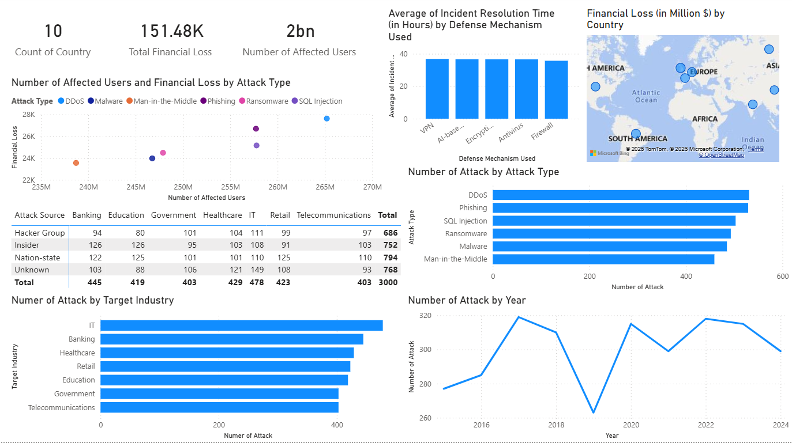

# Cyber Attack Analysis Dashboard

A comprehensive data visualization and analysis project tracking global cyber attack trends, financial impacts, and defense effectiveness using **Power BI**. This project provides deep insights into the evolving landscape of cybersecurity threats across different industries and regions.

## 📊 Dashboard Preview

## 🎯 Key Insights & Metrics

The dashboard analyzes a dataset covering global cyber incidents between **2016 and 2024**, highlighting several critical metrics:

-   **🌍 Global Reach**: Data from **10 countries** with widespread geographic impact.
-   **💸 Economic Impact**: Total financial loss estimated at **$151.48K**.
-   **👥 Human Scale**: Over **2 Billion affected users** worldwide.
-   **⚔️ Attack Trends**: High frequency of **DDoS**, **Phishing**, and **SQL Injection** attacks.
-   **🏢 Target Industries**: **IT**, **Banking**, and **Healthcare** emerge as the most frequently targeted sectors.
-   **🛠️ Defense Effectiveness**: Analysis of resolution times using various mechanisms like **VPN**, **AI-based detection**, **Encryption**, **Antivirus**, and **Firewall**.

## 🔍 Features

-   **Temporal Analysis**: Track the rise and fall of cyber attacks from 2016 to 2024.
-   **Correlation Mapping**: Relationship between the number of affected users and financial losses across different attack types.
-   **Geographic Visualization**: Map-based representation of financial losses by country.
-   **Source Attribution**: Detailed breakdown of attack sources (Hacker Groups, Nation-states, Insiders, etc.) per industry.
-   **Defense Benchmarking**: Comparison of average resolution times across different security layers.

## 🚀 How to View the Project

1.  **Direct Image**: View the [Output.png](Output.png) file for a quick snapshot of the dashboard.
2.  **Power BI File**: Download the [EDA.pbix](EDA.pbix) file and open it using [Power BI Desktop](https://powerbi.microsoft.com/desktop/) to interact with the data filters and visualizations.

## 🛠️ Built With

-   **Power BI Desktop** - Analysis and Visualization
-   **Cybersecurity Datasets** - Global Incident data

---
*Created with ❤️ for Cyber Security Awareness*
